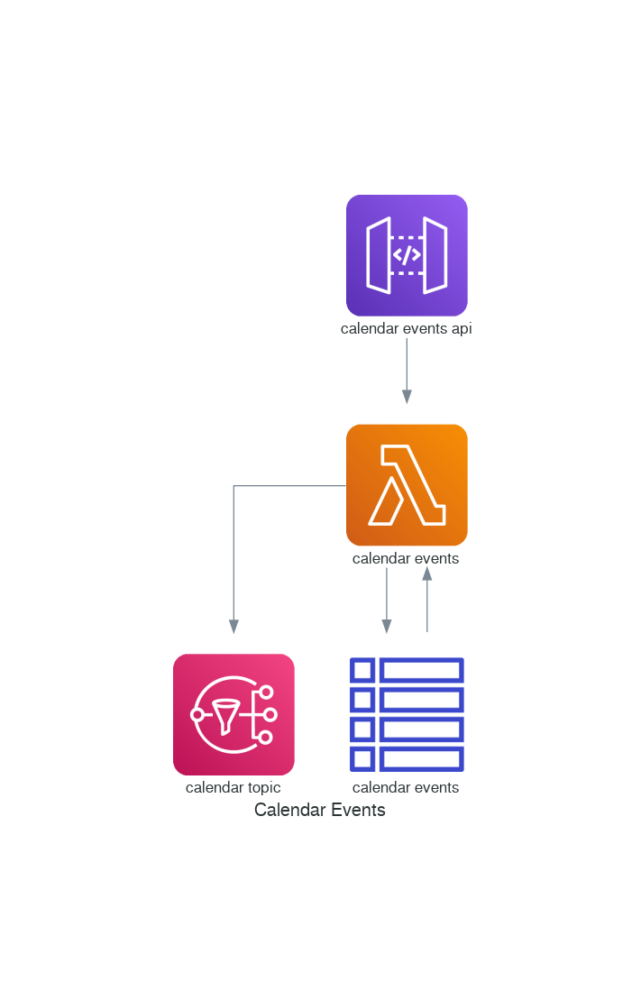

# Serverless Calendar Events

An event management function.



## Overview

Event management is useful for planning future activities as individuals or as a collaboration between multiple 
parties. Events may also be used to set reminders and alarms for outstanding work.

### Revisions

An event may consist of multiple revisions representing changes to the recorded details. Each revision is
stored as a separate record in the database. The unique identifiers making up the composite key include:

* UID - Unique identifier for the journal entry (shared by all revisions of an entry)
* Sequence Number - Incremental revision identifier (indicates new revision of an entry)
* Recurrence ID - A timestamp identifier for specific instances of a recurring journal entry

### Attachments

An event may refer to one or more attachments via an external link (URL) or an inline base64 encoded binary.

### Comments

One or more comments can be associated with an event, which are defined via inline text or an external
reference (URL).

### Contacts

Multiple contacts may also be associated with an event. Contact information may be defined as inline text
and/or an external reference (URI).

### Categories

Text-based labels or categories may be associated with an event. Categories may be used to group events by
project, type, label, etc.

Such categories would be prefixed with a category type id:

* `project:<project_id`
* `event_type:<type_id>`
* `label:<label_id>`

### Related

Related calendar entries, journals or tasks may also be recorded against an event. An example of this may be
when an event represents an action of previously recorded minutes (journal) or an outstanding task dependency.

### Classification

Events may be classified as public, private or confidential, and may be used to control access and other controls
enforced for an event.


## Specification

### Input Event

The following JSON structure is used to create, update and retrieve events.

#### Create event

```json
{
    "action": "compose",
    "summary": "A new event",
    "description": "A longer text description",
    "organizer": "John Doe",
    "categories": ["project:1", "event_type:meeting"]
}
```

#### Create recurring event

```json
{
    "action": "compose",
    "summary": "Daily Standup",
    "description": "Daily progress update",
    "organizer": "John Doe",
    "rrule": "FREQ=DAILY;BYDAY=MO,TU,WE,TH,FR"
}
```

#### Create entry revision

```json
{
    "action": "revision",
    "uid": "1234",
    "summary": "A event update",
    "description": "A longer text description",
    "organizer": "John Doe"
}
```

#### Create entry recurrence revision

```json
{
    "action": "revision",
    "uid": "1234",
    "recurrence-id": "20210214T150000Z",
    "summary": "Monthly retro",
    "description": "Change of time for this occurrence",
    "organizer": "John Doe"
}
```

#### List revisions

```json
{
    "action": "list",
    "uid": "1234",
    "depth": "-1"
}
```

#### Entry search

```json
{
    "action": "search",
    "from": "2020-01-01",
    "organizer": "johnd@example.com"
}
```

### DynamoDB

| PK                          | SK                            | Name                  | Date       | Organizer         | Summary                            | Description            | Priority | Status | Classification | URL                                     |
|-----------------------------|-------------------------------|-----------------------|------------|-------------------|------------------------------------|------------------------|----------|--------|----------------|-----------------------------------------|
| EVENT# `uid:seqno:recurid`  | #METADATA#`uid:seqno:recurid` | -                     | 2021-03-01 | johnd@example.com | Daily Standup                      | Daily progress updates | 1        |        | PRIVATE        | -                                       |
| EVENT# `uid:seqno:recurid`  | ATTACH#1                      | -                     | -          |                   | -                                  | -                      |          |        |                | https://files.example.com/timesheet.pdf |
| EVENT# `uid:seqno:recurid`  | CONTACT#1                     | John Doe              | -          |                   | -                                  | -                      |          |        |                | johnd@example.com                       |
| ORGANIZER#johnd@example.com | #METADATA#johnd@example.com   | John Doe              |            |                   |                                    |                        |          |        |                |                                         |
| CATEGORY#project:1          | #METADATA#project:1           | ACME Timesheet System |            |                   | Timesheet management for ACME inc. |                        |          |        |                |                                         |
| CATEGORY#label:work         | #METADATA#label:work          | Work                  |            |                   | Work-related events                |                        |          |        |                |                                         |
| CALENDAR#my-cal             | #METADATA#my-cal              | My Calendar           |            |                   |                                    |                        |          |        |                | http://calendar.example.com/my-cal.html |
| CALENDAR#my-cal             | EVENT#`uid`                   |                       |            |                   |                                    |                        |          |        |                |                                         |
